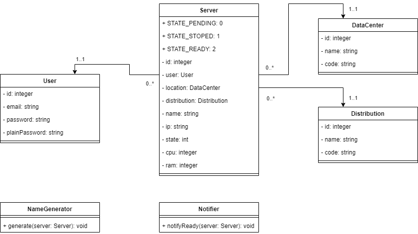

PHP OO - SeaCloud
===


### Création d'un site pour un hébergeur de serveur virtuels privés.

__SeaCloud__ est un hébergeur proposant des VPS (Virtual Private Server) pour les développeurs.
Outre la présentation de l'entreprise et de ses services, le site permet aux développeurs de 
créer un compte, puis de déployer des serveurs en quelques clics.

### Cahier des charges

En tant que développeur web travaillant chez __SeaCloud__, vous êtes chargé de __développer le
site internet__ d'après l'intégration fournie par les graphistes et en relation avec les autres
développeurs chargés de la mise en place de la plateforme de déploiement des serveurs.

💡 _Les fichiers fournis par les graphistes se trouvent dans le dossier __integration__._ 


1. Diagramme de classes

   Le diagramme suivant présentent les classes sur lesquelles vous vous êtes accordés avec l'équipe de
   développement de la plateforme de déploiement des serveurs. Prenez soin de respecter l'implémentation
   décrite ci-dessous.
   

   Notes :
   * Les constantes __STATE_PENDING__, __STATE_STOPED__ et __STATE_READY__ représentent l'état d'un serveur, 
     respectivement _&laquo;En attente&raquo;_, _&laquo;Arrêté&raquo;_ et _&laquo;Démarré&raquo;_.
   * La classe __App\Service\NameGenerator__ générera le nom d'un serveur 
     (si laissé vide par le client) selon le modèle :
   
         SC-[datacenter.code]-[distribution.code]-[server.id]
         
      _Example : SC-NY-Ubuntu-01_
   * La classe __App\Service\Notifier__ enverra un email au client (_User_) pour l'avertir que son serveur est déployé 
     (_STATE_READY_).


2. Plan du site

    Nom | Url | Description | Template
    --- | --- | --- | ---
    Home | GET / | Page d'accueil | index.html
    About | GET /about.php | Présentation de l'entreprise | about.html
    Services | GET /services.php | Listes des prestations |services.html
    Contact | GET /contact.php | Formulaire de contact | contact.html
    Signup | GET /sign-up.php | Création de compte client | sign-up.html
    Sign in | GET /sign-in.php | Connexion au compte client | sign-in.html
    Logout | GET /logout.php | Déconnexion du compte client | 
    🔒 Dashboard | GET /account_dashboard.php | Tableau de bord | account_dashboard.html
    🔒 Profil | GET /account_profil.php | Information client | account_profil.html
    🔒 New server | GET /account_new-server.php | Formulaire de création d'un nouveau serveur | account_new-server.html
    🔒 Server detail | GET /account_server-detail.php?id=[server-id] | Détail du serveur ayant l'identifiant _[server-id]_ | account_new-server.html
    🔒 Reboot server | GET /account_reboot.php?id=[server-id] | Redémarrer le serveur ayant l'identifiant _[server-id]_ | 
    🔒 Reset server | GET /account_server-reset.php?id=[server-id] | Réinstaller le serveur ayant l'identifiant _[server-id]_ | 
    🔒 Delete server | POST /account_server-delete.php?id=[server-id] | Supprimer le serveur ayant l'identifiant _[server-id]_ | 
    Server ready | GET /api_ready.php?id=[server-id] | Marquer un serveur comme "Démarré" _(appelée par la plateforme de déploiement)_ 

   💡 _Les pages marquées d'un cadenas (🔒) sont sécurisées : l'internaute doit être authentifié (connecté) pour y accéder_.


3. Cycle de vie d'un serveur

   * L'état initial d'un serveur est &laquo;En attente&raquo; (_STATE_PENDING_).
   * Une fois le serveur déployé, la plateforme  de déploiement (gérée par d'autres développeurs) appelera 
   l'url ```GET /api_ready.php?id=[server-id]``` pour marquer le serveur comme étant &laquo;Prêt&raquo; (_STATE_READY_).
     Un email sera automatiquement envoyé au client pour l'informé du déploiement de sont serveur.
   * Si le client décide de redémarrer un serveur, ce dernier passera en statut &laquo;Arrêté&raquo; (_STATE_STOPED_). 
     Une fois redémarré, la plate forme de déploiement appellera de nouveau l'url ```GET /api_ready.php?id=[server-id]```.
   * Si le client décide de réinitialiser un serveur, ce dernier passera en statut &laquo;En attente&raquo; 
     (_STATE_PENDING_). Une fois re-déployé, la plate forme de déploiement appellera de nouveau l'url 
     ```GET /api_ready.php?id=[server-id]```.


### Annexes

1. Liste des datacenters

Nom | Code
--- | ---
New York | NY
San Francisco | SF 
Amsterdam | AM
Singapore | SI
London | LO
Frankfurt | FR 
Toronto | TO
Bangalore | BA

2. Liste des distributions

Nom | Code
--- | ---
Ubuntu 20.04 (LTS) x64 | Ubuntu
FreeBSD 12.2 x64 | FreeBSD
Fedora 34 x64 | Fedora
Debian 10 x64 | Debian
CentOS 8.3 x64 | CentOS
